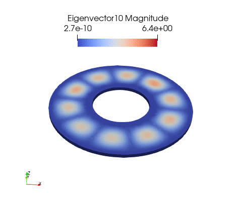

### Introduction
This package is made in order to provide a free tool to compute mode shapes and natural frequencies of disks with all kind of boundary conditions. 

Examples: 



### Import Classes
```
import comp_modeshape_disk as cmd
from comp_modeshape_disk.Classes.DiskMesh import DiskMesh
from comp_modeshape_disk.Classes.Material import Material
from comp_modeshape_disk.Classes.Simulation import Simulation
```

### 2D annular disk
```
# ======
# Mesh Object
# ======
# 2D annular disk
Rint = 0.04     #[m] inner radius
Rext = 0.1      #[m] outer radius
Rholes = 0.0    #[m] holes radius
res = 80        #[m] resolution
mesh2d_obj = DiskMesh(Rint=Rint, 
                      Rext=Rext, 
                      Rholes=Rholes, 
                      res=res)

# ======
# Material Object
# ======
E = 72000*1e6       # [kg/m/s**2] Young moduls
nu = 0.3            # [#] Poisson ratio
rho = 2800          # [kg/m^3] density
mat_obj = Material(E, nu, rho)

# ======
# Simulation Object
# ======
# boundary conditions 'C': clamped, 'F': free
# neig: number of eigen value
for bc in ['CF', 'FF', 'CC', 'FC']:
    simu2d = Simulation(mesh_obj = mesh2d_obj, 
                  mat_obj = mat_obj,
                  bc = bc,
                  save_path = 'Simulation2D/',
                  neig = 20
                  )
    simu2d.run()
```


### 3D annular disk
```
# ======
# Mesh Object
# ======
# 3D annular disk
Rint = 0.04     #[m] inner radius
Rext = 0.1      #[m] outer radius
Rholes = 0.0    #[m] holes radius
h = 0.005       #[m] thickness
mesh3d_obj = DiskMesh(Rint=Rint,
                      Rext=Rext,
                      h=h,
                      load_path='Geometry/',
                      mesh_name='annular_disk_3d.msh')   # load GMSH mesh

# ======
# Simulation Object
# ======
for bc in ['CF', 'FF', 'CC', 'FC']:
    simu3d = Simulation(mesh_obj = mesh3d_obj, 
                  mat_obj = mat_obj,
                  bc = bc,
                  save_path = 'Simulation3D/',
                  neig = 20
                  )
    simu3d.run()
```

### 3D disk (coming soon)


### Install Fenics 
If you are using Linux, you can intall Fenics following this [guidelines](https://fenicsproject.org/download/). 

If you are using Window, you can install [Docker Desktop](https://www.docker.com/products/docker-desktop) and download or make your own Fenics image following this [guidelines](https://fenics.readthedocs.io/projects/containers/en/latest/). 

If you are using Window 10, you can install Window Linux Subsystem (WLS) and install Fenics to WLS as in Linux. 

